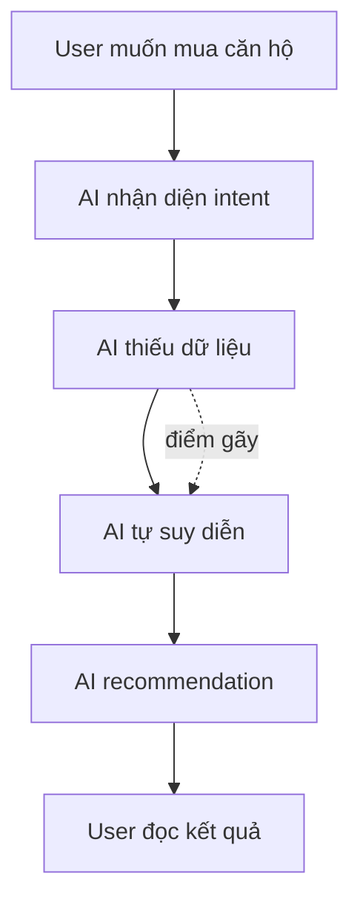
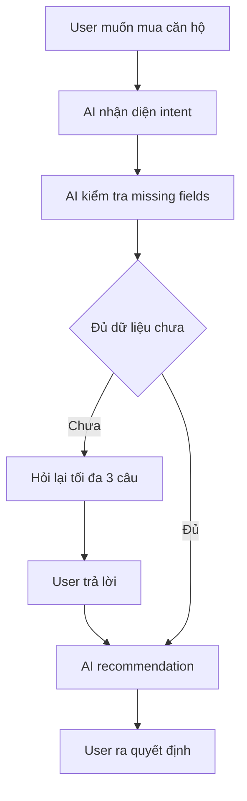
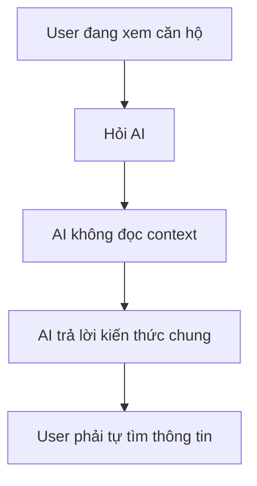
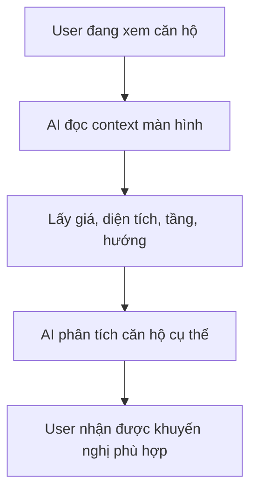
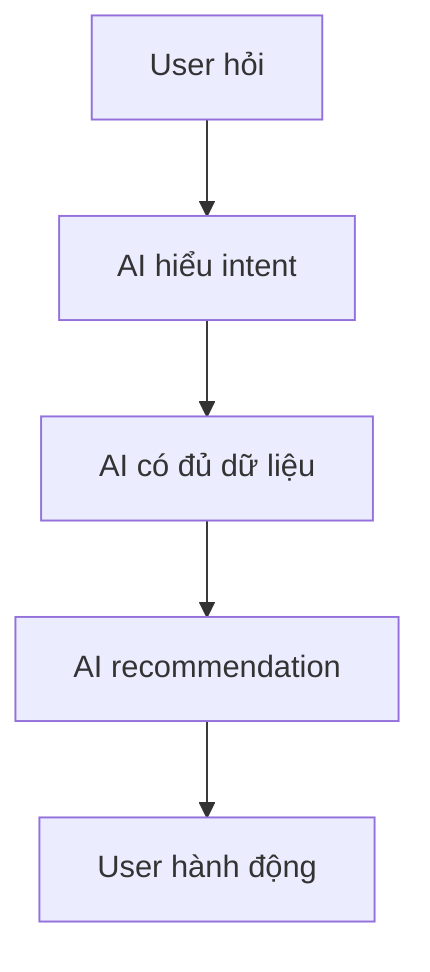
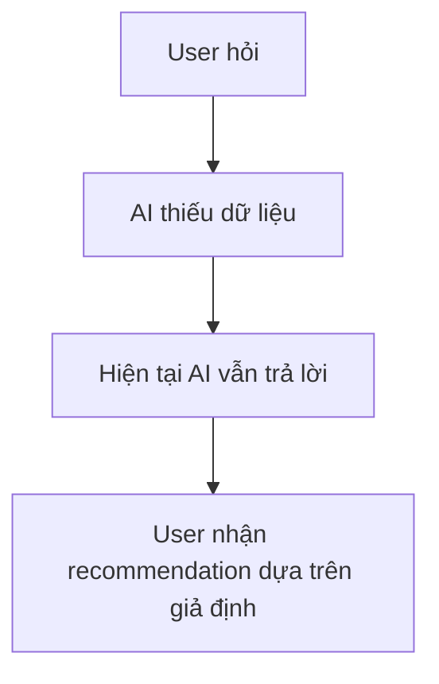
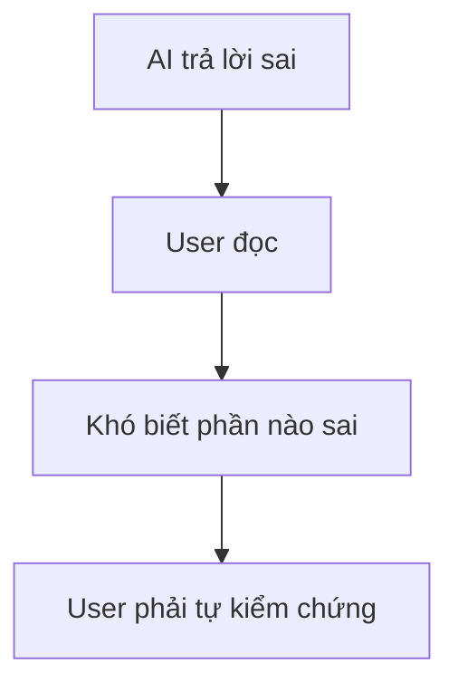
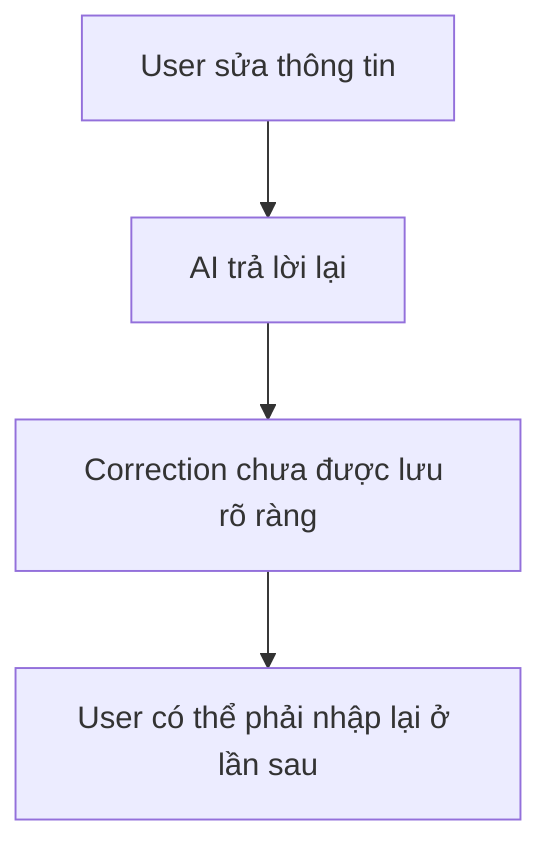

# Workshop — Mổ App AI Thật

**Sản phẩm được chọn:** V-App — V-AI
**AI feature:** Trợ lý voice/text, gợi ý theo ngữ cảnh trong ứng dụng V-App
**Thời gian thực hiện:** 35-45 phút
**Hình thức:** cá nhân trước, chia sẻ theo nhóm sau
**Output:** finding note + sketch `as-is / to-be`

---

# 1. Chọn một sản phẩm để dùng thử

| Sản phẩm               | AI feature                                     | Cách truy cập    |
| ---------------------- | ---------------------------------------------- | ---------------- |
| MoMo — Moni            | Trợ thủ tài chính, phân tích chi tiêu, chatbot | App MoMo         |
| Vietnam Airlines — NEO | Chatbot hỗ trợ vé, hành lý, khiếu nại          | Website/Zalo VNA |
| **V-App — V-AI**       | **Trợ lý voice/text, gợi ý theo ngữ cảnh**     | **App V-App**    |

**Sản phẩm được chọn:** V-App — V-AI

**Lý do chọn:**

Theo truyền thông chính thức, V-AI được định vị là trợ lý AI cho toàn bộ hệ sinh thái Vingroup. AI không chỉ trả lời câu hỏi mà còn hỗ trợ người dùng ra quyết định trong các dịch vụ như Vinhomes, VinFast, Vinpearl, VinWonders...

Vì vậy kỳ vọng của tôi không phải là một chatbot tìm kiếm thông tin, mà là một trợ lý có khả năng hiểu ngữ cảnh và hỗ trợ hành động thực tế.

---

# 2. Dùng thử: promise vs reality

## 2.1. Product hứa gì?

V-AI được giới thiệu là:

* Trợ lý AI hỗ trợ hội thoại tự nhiên bằng văn bản hoặc giọng nói.
* Có khả năng gợi ý theo ngữ cảnh.
* Hỗ trợ nhiều dịch vụ trong hệ sinh thái Vingroup.
* Giúp người dùng tìm thông tin và đưa ra quyết định nhanh hơn.

---

## 2.2. User nào được hứa sẽ được giúp?

Nhóm user chính:

* Khách hàng Vinhomes.
* Chủ xe VinFast.
* Người dùng dịch vụ Vinpearl, VinWonders.
* Người dùng V-App muốn được hỗ trợ trong các nhu cầu đời sống hằng ngày.

---

## 2.3. Kỳ vọng AI làm được task nào?

Tôi kỳ vọng V-AI có thể:

### 1. Tư vấn mua căn hộ Vinhomes

* So sánh dự án.
* Phân tích nhu cầu người mua.
* Hỏi lại khi thiếu dữ liệu.
* Đề xuất dự án phù hợp.

### 2. Hỗ trợ đánh giá phương án vay mua nhà

* Ước tính khoản vay.
* Tính chi phí phát sinh.
* Phân tích rủi ro.
* Đưa ra các câu hỏi nên hỏi ngân hàng.

### 3. Hỗ trợ kiểm tra thông tin trước khi đăng ký tư vấn

* Giá bán.
* Diện tích.
* Loại căn.
* Chính sách thanh toán.
* Rủi ro pháp lý.

---

## 2.4. Prompt/input đã thử

### Query 1 — Tư vấn mua căn hộ

```text
Tôi có ngân sách khoảng 3 đến 4 tỷ và muốn mua căn hộ Vinhomes để ở cùng gia đình trong 5 năm tới. Bạn hãy hỏi tôi thêm tối đa 3 câu về nhu cầu, sau đó gợi ý loại căn và tiêu chí chọn dự án phù hợp.
```

---

### Query 2 — So sánh dự án

```text
So sánh tiện ích Vinhomes Smart City và Ocean Park.
```

---

### Query 3 — Kiểm tra thông tin trước khi đăng ký tư vấn

```text
Tôi đang xem một căn hộ Vinhomes trong app. Bạn hãy kiểm tra giúp tôi những thông tin quan trọng trước khi bấm đăng ký tư vấn, bao gồm giá, diện tích, tầng, hướng, loại căn, chính sách thanh toán và rủi ro cần hỏi lại nhân viên tư vấn.
```

---

### Query 4 — Tính toán khoản vay

```text
Tôi có 1,2 tỷ tiền mặt và muốn mua căn hộ khoảng 3,5 tỷ. Bạn hãy giúp tôi ước lượng khoản vay, các chi phí phát sinh, rủi ro trả góp và những câu hỏi cần hỏi ngân hàng trước khi quyết định.
```

---

## 2.5. Hành vi quan sát được

### Observation 1 — Tư vấn mua căn hộ

V-AI trả lời rất đầy đủ, có nguồn tham khảo, có bảng so sánh và có các câu hỏi gợi ý tiếp theo.

Tuy nhiên AI không làm đúng yêu cầu hỏi tối đa 3 câu trước khi tư vấn.

AI đưa ra khuyến nghị ngay khi chưa biết:

* Gia đình bao nhiêu người.
* Nơi làm việc.
* Mục tiêu ở hay đầu tư.
* Nhu cầu trường học, bệnh viện.

**Điểm gãy:** AI đưa ra recommendation khi dữ liệu đầu vào chưa đủ.

---

### Observation 2 — So sánh Smart City và Ocean Park

V-AI tổng hợp khá tốt:

* Tiện ích.
* Y tế.
* Giáo dục.
* Công viên.
* Giao thông.

Tuy nhiên AI chỉ mô tả dự án.

AI không hỏi:

* User làm việc khu vực nào.
* Có con nhỏ hay không.
* Ưu tiên môi trường sống hay khả năng kết nối.

**Điểm gãy:** AI trả lời như công cụ tổng hợp thông tin thay vì công cụ hỗ trợ quyết định.

---

### Observation 3 — Kiểm tra thông tin căn hộ

Prompt nói rõ:

```text
Tôi đang xem một căn hộ trong app
```

Nhưng AI không hỏi căn hộ nào.

AI cũng không sử dụng dữ liệu của căn hộ đang được xem.

Thay vào đó AI trả lời bằng kiến thức chung về toàn bộ sản phẩm Vinhomes.

**Điểm gãy:** AI chưa tận dụng được ngữ cảnh màn hình hiện tại.

---

### Observation 4 — Tính toán khoản vay

V-AI:

* Tính đúng khoản vay cần thiết.
* Liệt kê chi phí phát sinh.
* Nêu rủi ro trả góp.
* Đề xuất câu hỏi nên hỏi ngân hàng.

Đây là câu trả lời có chất lượng khá tốt.

Tuy nhiên AI vẫn không biết:

* Thu nhập thực tế.
* Nghề nghiệp.
* Quỹ dự phòng.
* Các khoản nợ khác.

Nhưng vẫn đưa ra khuyến nghị tài chính.

**Điểm gãy:** Một số recommendation được tạo ra từ giả định chưa được xác nhận.

---

# 3. Vẽ 4 paths

| Path           | Câu hỏi cần trả lời                           | Quan sát trên V-AI                                                          |
| -------------- | --------------------------------------------- | --------------------------------------------------------------------------- |
| Happy          | Khi AI đúng và tự tin, user thấy gì?          | AI tổng hợp thông tin tốt, có nguồn tham khảo, có CTA tiếp theo.            |
| Low-confidence | Khi AI không chắc, hệ thống có hỏi lại không? | Chưa thấy cơ chế hỏi lại rõ ràng khi thiếu dữ liệu quan trọng.              |
| Failure        | Khi AI sai, user biết bằng cách nào?          | AI hiếm khi đánh dấu phần nào là giả định và phần nào là dữ liệu chắc chắn. |
| Correction     | Khi user sửa, correction có được lưu không?   | Chưa thấy cơ chế lưu correction hoặc preference lâu dài.                    |

---

# 4. Finding thành quyết định product

## Finding 1 — AI recommendation khi thiếu dữ liệu

```text
Khi user yêu cầu tư vấn mua căn hộ,
AI đưa ra recommendation dù chưa biết các thông tin quan trọng như số thành viên gia đình, vị trí làm việc hay mục tiêu sử dụng.

Hậu quả là recommendation có vẻ hợp lý nhưng chưa chắc phù hợp với hoàn cảnh thực tế của user.

Lỗi thuộc layer Intent + Recommendation.

Nên sửa bằng requirement:
AI phải phát hiện missing fields trước khi recommendation.
```

### Product Decision

Ưu tiên xây dựng bước Clarification trước Recommendation thay vì tiếp tục mở rộng lượng nội dung trả lời.

---

## Finding 2 — AI chưa tận dụng ngữ cảnh trong app

```text
Khi user nói đang xem một căn hộ cụ thể trong app,
AI không sử dụng dữ liệu của căn hộ đó mà trả lời bằng kiến thức chung về Vinhomes.

Hậu quả là trải nghiệm không khác biệt đáng kể so với chatbot web thông thường.

Lỗi thuộc layer Context Retrieval + Data Tool.

Nên sửa bằng requirement:
AI phải ưu tiên truy xuất context màn hình hiện tại hoặc hỏi lại đối tượng đang được xem.
```

### Product Decision

Ưu tiên Context Awareness trước khi mở rộng thêm nguồn dữ liệu hoặc tăng độ dài câu trả lời.

---

## Finding 3 — Low-confidence path chưa rõ ràng

```text
Khi AI không có đủ dữ liệu để kết luận,
AI vẫn thường trả lời bằng các giả định ngầm.

Hậu quả là user khó biết phần nào chắc chắn và phần nào chỉ là suy luận.

Lỗi thuộc layer UX Recovery.

Nên sửa bằng requirement:
AI phải hiển thị rõ các giả định hoặc yêu cầu user xác nhận trước khi đưa ra kế hoạch cuối cùng.
```

### Product Decision

Bổ sung Assumption Confirmation Flow thay vì chỉ thêm cảnh báo chung ở cuối câu trả lời.

---

# 5. Sketch as-is / to-be

## 5.1. Flow 1 — Tư vấn mua căn hộ

### As-is



### To-be



---

## 5.2. Flow 2 — User đang xem căn hộ trong app

### As-is



### To-be



---

# 6. Tổng hợp 4 paths

## Happy Path



---

## Low-confidence Path



---

## Failure Path



---

## Correction Path



---

# 7. Finding note cuối cùng

## Finding chính

```text
Khi user sử dụng V-AI cho các quyết định mang tính cá nhân như mua nhà hoặc vay vốn,

AI thường đưa ra recommendation trước khi có đủ dữ liệu cần thiết.

Hậu quả là user nhận được câu trả lời có vẻ đầy đủ nhưng mức độ cá nhân hóa còn thấp.

Lỗi thuộc layer Intent + Context + Recommendation.

Nên sửa bằng cơ chế Context Check:
1. Kiểm tra dữ liệu bắt buộc.
2. Xác định dữ liệu còn thiếu.
3. Hỏi lại hoặc xác nhận giả định.
4. Sau đó mới recommendation.
```

---

## Product Decision

```text
Không nên ưu tiên làm câu trả lời dài hơn.

Ưu tiên cao nhất nên là:
- Clarification Flow
- Context Awareness
- Assumption Confirmation

để V-AI hoạt động như một trợ lý theo ngữ cảnh thay vì một chatbot tổng hợp thông tin.
```

---

# 8. SPEC change đề xuất

## Requirement 1 — Missing field detection

```text
V-AI must detect missing critical fields before generating recommendations for housing, finance and planning tasks.
```

---

## Requirement 2 — Assumption confirmation

```text
If V-AI needs to use assumptions, those assumptions must be shown and confirmed by the user before the final recommendation is generated.
```

---

## Requirement 3 — Context retrieval

```text
When the user asks about an object currently displayed inside V-App, V-AI must prioritize retrieving screen context before answering.
```

---

## Requirement 4 — Correction loop

```text
V-AI should provide structured actions after recommendations:

- Sửa giả định
- Tính lại
- Lưu preference
- Báo thông tin sai
- Chuyển nhân viên hỗ trợ
```

---

# 9. Tự kiểm trước khi nộp

* [x] Có observation cụ thể từ trải nghiệm thật.
* [x] Có đủ 4 paths.
* [x] Finding được chuyển thành product decision.
* [x] Có as-is và to-be flow.
* [x] Có SPEC change cụ thể.
