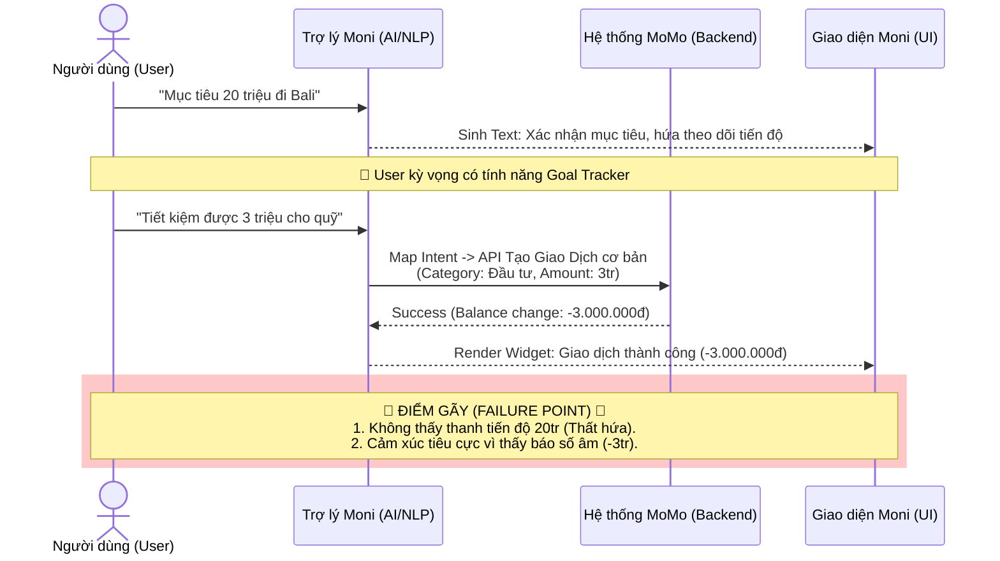
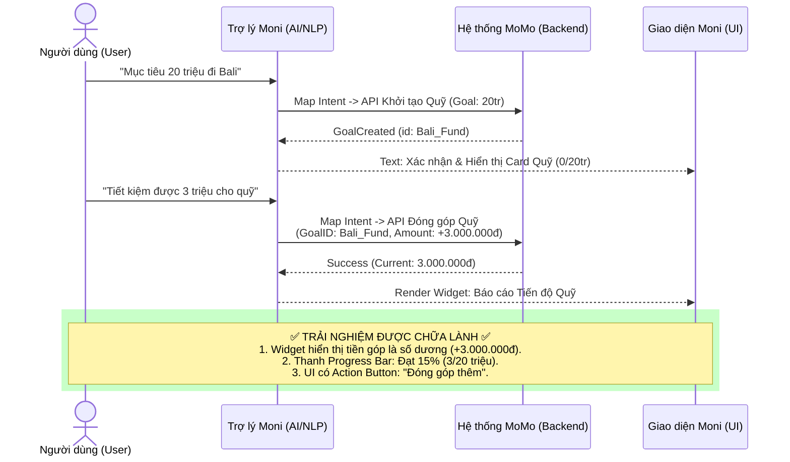

# Báo cáo Mổ App AI Thật: Trợ thủ Moni (MoMo)
**Người thực hiện:** Đỗ Phan Hà (Mã: 2A202600543)

## 1. Dùng thử: Promise vs Reality

- **Sản phẩm:** MoMo — Moni (Trợ thủ tài chính, phân tích chi tiêu, chatbot)
- **Product hứa gì?** Giúp ghi chép, phân loại giao dịch, theo dõi tổng tiền, đặt ngân sách, và đặc biệt là hứa hẹn theo dõi tiến độ tiết kiệm cho một mục tiêu cụ thể.
- **User nào được hứa?** Người dùng MoMo có nhu cầu quản lý tài chính cá nhân hoặc xây dựng quỹ chi tiêu/tiết kiệm chung với người khác.
- **Kỳ vọng:** Khi tạo mục tiêu "Quỹ Bali 20 triệu", user kỳ vọng AI sẽ có tính năng Goal Tracker trực quan (có thanh tiến độ, báo cáo số tiền còn thiếu).
- **Điểm gãy (Breakdown):** Khi user nhập "tiết kiệm được 3 triệu cho quỹ Bali", hệ thống không hiển thị tiến độ mà chỉ gọi API tạo giao dịch thông thường và ghi nhận là một khoản chi âm (`-3.000.000đ`).

**Evidence (Observation & Prompt):**
- *Lượt 1 (User):* "Tôi và người yêu cũ đang có dự định xây dựng một quỹ chi tiêu riêng. Bạn có thể hỗ trợ quản lý chi tiêu được không?" -> *Moni hứa hẹn hỗ trợ.*
- *Lượt 2 (User):* "mục tiêu quỹ là tiết kiệm được 20 triệu để đi du lịch Bali cùng người yêu cũ" -> *Moni xác nhận mục tiêu 20 triệu, hứa theo dõi tiến độ, báo cáo tiền còn thiếu.*
- *Lượt 3 (User):* "tiết kiệm được 3 triệu cho quỹ Bali" -> *Moni trả về widget giao dịch với danh mục Đầu tư, số tiền -3.000.000đ. Không có goal tracker.*

## 2. Phân tích 4 Paths

| Path | Nhận xét trong ca sử dụng |
|---|---|
| **Happy** | Nếu user chỉ nhập "Ăn sáng 30k", Moni hiểu đúng Intent và tạo giao dịch -30.000đ chính xác. |
| **Low-confidence** | Trong ngữ cảnh tạo Quỹ, Moni *quá tự tin* (overconfident) vào khả năng của mình, tự sinh ra lời hứa (capability hallucination) thay vì báo low-confidence rằng hệ thống chưa có tính năng Goal Tracker. |
| **Failure** | Moni map sai mô hình tư duy (Mental model mismatch): "Đóng góp quỹ" (+) bị map thành "Chi tiêu ví" (-). Người dùng thấy số âm (-3tr) và cảm thấy hụt hẫng, không muốn tiếp tục tiết kiệm. |
| **Correction** | Hệ thống không có cơ chế correction trực tiếp trong chat để chuyển khoản chi này thành quỹ. Người dùng phải tự thoát ra, vào Sổ chi tiêu để xóa giao dịch thủ công. |

## 3. Viết finding thành quyết định

**Finding & Product Decision:**
Khi user **[nhập số tiền đóng góp vào quỹ mục tiêu]**,
AI/product **[map sai intent sang API Thêm Giao Dịch thông thường và ghi nhận là khoản chi âm]**,
hậu quả là **[người dùng bị hụt hẫng vì không có thanh tiến độ như AI hứa hẹn, đồng thời bối rối vì số tiền đóng góp bị hiển thị số âm]**.
Lỗi thuộc layer **[Intent Mapping / Capability Hallucination]**.
Nên sửa bằng **[xây dựng UI Widget Goal Tracker thực thụ cho phép hiển thị số dư dương (+) và thanh tiến trình (Progress bar)]**.

> **Đề xuất thay đổi SPEC:** Bổ sung intent `Add_Fund_Contribution`, mapping tới API `GoalTracker` thay vì API `Ledger_Expense`, đồng thời render thẻ UI Component riêng biệt cho mục tiêu tài chính thay vì dùng lại thẻ UI Transaction.

## 4. Sketch As-is / To-be

Dưới đây là sơ đồ so sánh luồng hiện tại (As-is) chứa điểm gãy và luồng đề xuất (To-be) đã được sửa lỗi UX.

### Flow As-is (Hiện tại)

### Flow To-be (Đề xuất)

