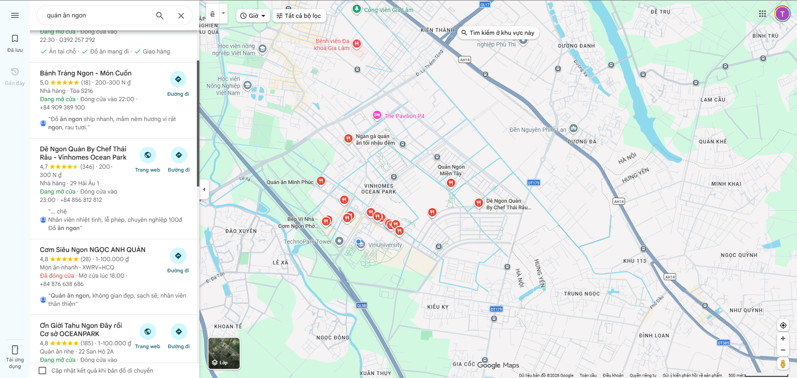
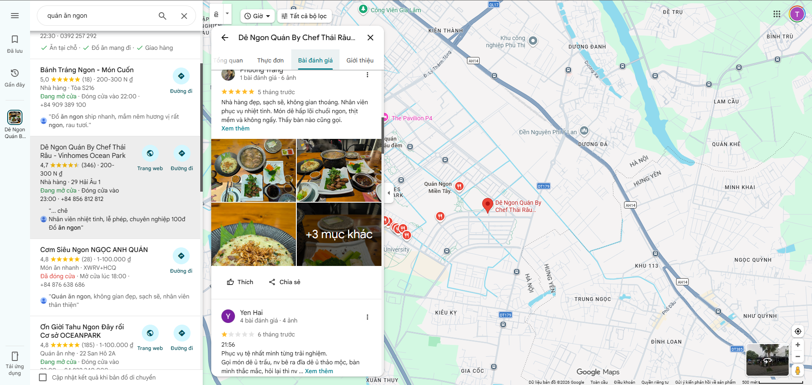
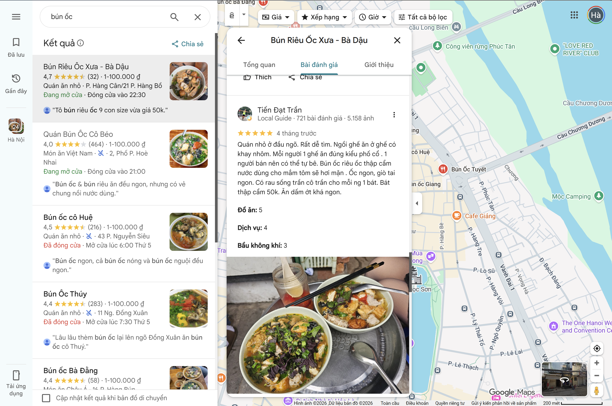

# Evidence Pack

## 1. Nhóm và track

**Tên nhóm:** Bàn D2 - C401  
**Track:** Food & Local Delivery  
**Product/app đã chọn:** Tính năng gợi ý quán ăn theo vị trí (Location-based Food Recommendation)  
**Build slice đang nghĩ:** Cho khách du lịch đến địa điểm lạ đang tìm quán ăn, prototype dùng AI để hỏi 2-3 câu về nhu cầu cá nhân (ngân sách, khẩu vị, đi mấy người) và gợi ý 3 quán ăn phù hợp nhất gần vị trí của họ, đồng thời cho biết lý do tại sao lại gợi ý quán này.  

## 2. Self-use evidence

Nhóm tự đóng vai khách du lịch dùng các app hiện tại (Google Maps, ShopeeFood, GrabFood) tại một khu vực lạ và ghi lại điểm gãy.

| Observation | Screenshot/link | Path liên quan | Điều học được |
|---|---|---|---|
| Khi tìm "quán ăn ngon" trên app, kết quả ra rất nhiều và lẫn lộn, khó biết cái nào hợp với mình |  | Failure | Tìm kiếm quá chung chung khiến user bị ngợp (choice overload). |
| Đọc review tốn nhiều thời gian, review khen chê lẫn lộn khó quyết định |  | Low-confidence | User cần một sự tóm tắt nhanh chóng và đáng tin cậy hơn là tự đọc hàng chục review. |
| Tìm quán trên Google Maps khu Phố Cổ thấy rating cao và món ăn hấp dẫn, nhưng không biết không gian quán rất chật, vỉa hè hẹp, không thể ngồi được nếu đi nhóm đông người hoặc có trẻ em. |  | High-effort / Failure | Google Maps (hay các app) thường ưu tiên show ảnh đồ ăn. Trải nghiệm phụ thuộc vào ngữ cảnh đi cùng ai (nhóm đông, có trẻ nhỏ), user cần biết thông tin này trước để tránh mất công di chuyển. |

## 3. User / review / social evidence

| Quote / review / observation | Nguồn | User là ai? | Pain/failure mode |
|---|---|---|---|
| "Đọc danh sách tổng hợp trên blog du lịch thấy giới thiệu rất nhiều quán, nhưng do bài viết cũ nên lúc tới nơi quán đã đóng cửa hoặc đổi giờ mở cửa, mất công đi lại." | Phỏng vấn | bạn Giáp (Khách du lịch tự túc) | Cảm thấy hụt hẫng và lãng phí thời gian do thông tin quán ăn tĩnh (static data) không được cập nhật realtime. |
| "Mở app Shopee/Grab tìm quán đặc sản thì thuật toán toàn ưu tiên hiển thị các chuỗi gà rán Fastfood hoặc quán chạy quảng cáo, muốn tìm đặc sản thật sự phải lướt rất lâu." | Phỏng vấn | bạn Lâm (Khách du lịch muốn khám phá ẩm thực) | App giao đồ ăn thiếu tính cá nhân hóa theo context du lịch (gợi ý chung chung). |
| "Lên xem xếp hạng quán ăn thì thấy top đầu toàn là review tiếng Anh của khách Tây, khẩu vị và tiêu chí đánh giá của họ không hợp với người Việt mình, ăn thử thấy rất bình thường." | Phỏng vấn | bạn Đạt (Khách du lịch gia đình người Việt) | Không tin tưởng vào hệ thống rating chung, cần có một hệ thống hiểu rõ khẩu vị và preference cá nhân. |


## 4. Competitor / analog evidence

| App / mô hình tham khảo | Họ xử lý task này thế nào? | Pattern học được | Có áp dụng trong 1 ngày không? |
|---|---|---|---|
| Google Maps | Gợi ý dựa trên rating và category. | Cần có bộ lọc tốt nhưng AI chưa thực sự giao tiếp để hiểu ý định sâu của user. | Không (đòi hỏi data lớn). |
| Tripadvisor | Xếp hạng theo "Traveler's Choice". | Gắn mác uy tín để tăng trust. | Có (có thể cho AI gán nhãn lý do gợi ý). |

## 5. Evidence -> Insight

```text
Evidence nổi bật nhất:
User bị ngợp bởi thông tin (quá nhiều quán, quá nhiều review trái chiều) và tốn nhiều thời gian tìm hiểu khu vực lạ.

Insight:
Khách du lịch không chỉ cần [một danh sách các quán ăn xung quanh].
Thật ra họ cần [sự hỗ trợ ra quyết định nhanh chóng, cá nhân hóa theo khẩu vị/ngân sách và đáng tin cậy],
vì họ [không quen thuộc khu vực và sợ trải nghiệm tệ làm hỏng chuyến đi].

Opportunity:
AI có thể giúp bằng cách [augment hành động tìm kiếm: thay vì user tự lọc, AI chủ động hỏi nhu cầu và tóm tắt lý do chọn quán].
```

## 6. Evidence đổi SPEC như thế nào?

- [x] Đổi user chính.
- [x] Đổi pain statement.
- [x] Đổi build slice.
- [ ] Đổi Auto/Aug decision.
- [ ] Đổi 4 paths.
- [ ] Đổi failure mode.
- [ ] Đổi owner/test plan.

Ghi rõ 1-2 thay đổi quan trọng:

```text
Trước evidence, nhóm định: Xây dựng một tính năng search chung chung cho mọi user tìm quán ăn.
Sau evidence, nhóm đổi thành: Tập trung hẹp vào "Khách du lịch" (những người không rành đường) và dùng AI đóng vai trò Local Guide gợi ý cá nhân hóa.
Lý do: Để tính năng có giá trị và phân biệt được với Google Maps hay search thông thường.
```
